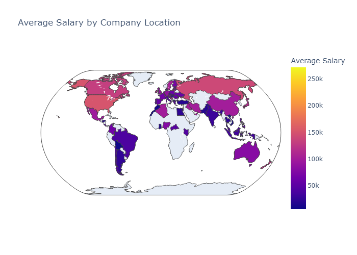
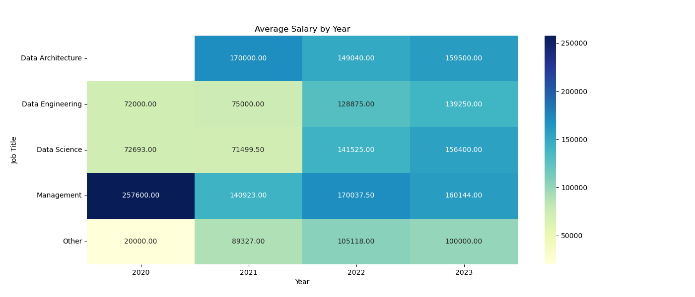

# Data Science Salary
## Data presentation
The data is from Kaggle's dataset of [Data Science Salary 2023](https://www.kaggle.com/datasets/arnabchaki/data-science-salaries-2023)

|    |   work_year | experience_level       | employment_type   | job_title                |   salary_in_usd | employee_residence   |   remote_ratio | company_location   | company_size   | job_category     |
|---:|------------:|:-----------------------|:------------------|:-------------------------|----------------:|:---------------------|---------------:|:-------------------|:---------------|:-----------------|
|  0 |        2023 | Senior                 | Full-time         | Principal Data Scientist |           85847 | ESP                  |            100 | ESP                | LARGE          | Data Science     |
|  1 |        2023 | Mid/Intermediate level | Contractor        | ML Engineer              |           30000 | USA                  |            100 | USA                | SMALL          | Data Engineering |
|  2 |        2023 | Mid/Intermediate level | Contractor        | ML Engineer              |           25500 | USA                  |            100 | USA                | SMALL          | Data Engineering |
|  3 |        2023 | Senior                 | Full-time         | Data Scientist           |          175000 | CAN                  |            100 | CAN                | MEDIUM         | Data Science     |
|  4 |        2023 | Senior                 | Full-time         | Data Scientist           |          120000 | CAN                  |            100 | CAN                | MEDIUM         | Data Science     |
### Data cleaning
 - Removed local salary and currency columns
 - Removed all rows where `salary_in_usd` was null
 - Converted `company_location` and `employee_residence` to alpha-3 instead of alpha-2
### Data distribution

### Data analysis
#### Average Salary by company location

### Average Salary by job title and year

Github link: https://github.com/MateusZ36/dataScienceSalaries